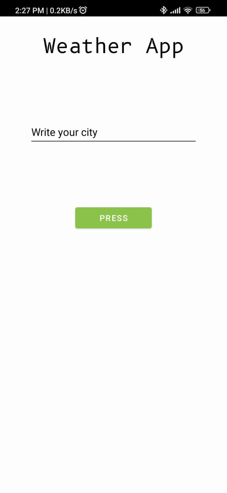
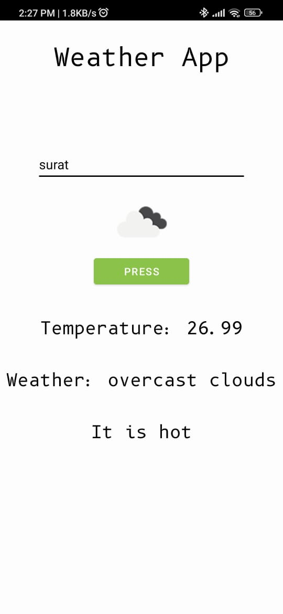
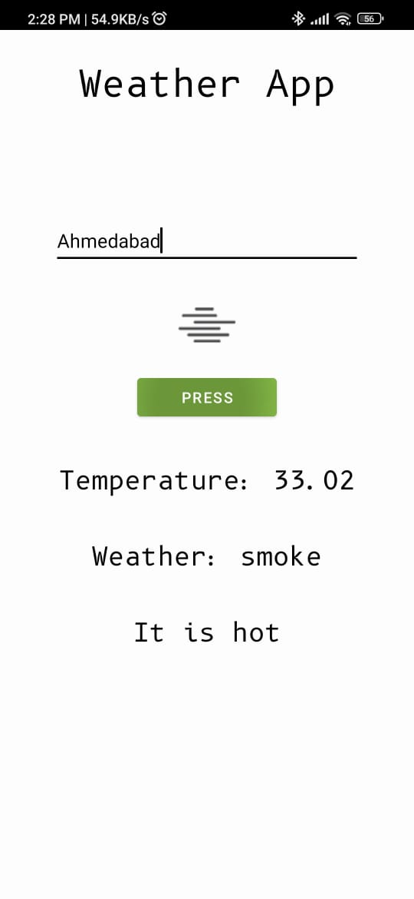
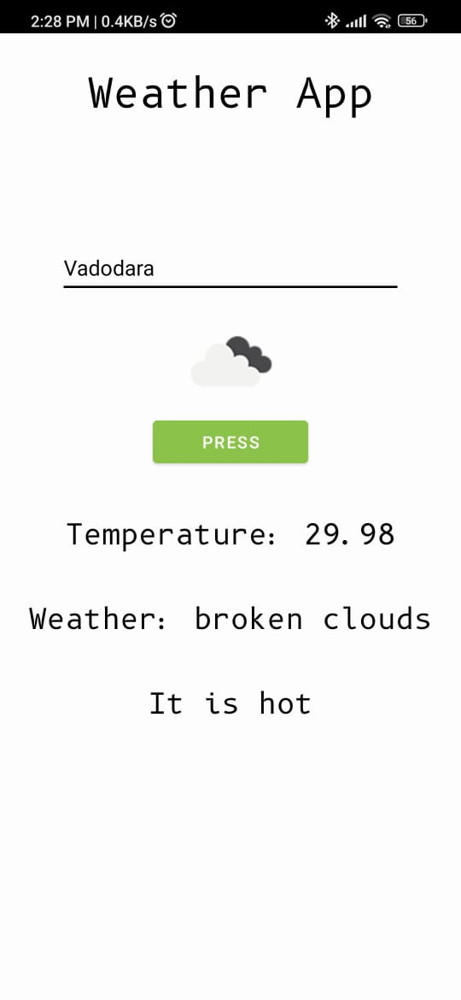

# WeatherApp
This app will show weather of city which you have searched.
<ul>
    <li>Search city & see weather</li>
    
</ul>

<H2>Prerequisites</H2>

<ul>
    <li>Java</li>
    <li>Android Studio</li>
    <li>Openweather Api</li>
    
</ul>

<H2>Screenshots<H2>

